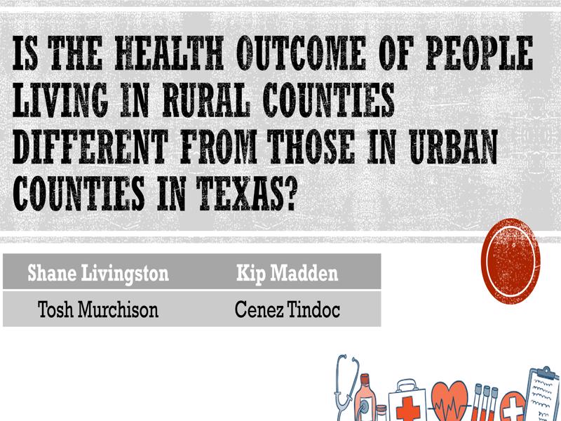

# Do urban counties have better health outcomes in Texas?

Our hypothesis is:

## Urban counties have a better health outcome than rural counties in Texas.

# Project Description/Outline
We merged county health data and demographic data for Texas for 2019 with two classifications of Urban and Rural. Then we  settled on a dependent health outcome measure and determined if there is a statistical difference between the Urban and Rural counties. Next we found correlated factors that have an impact on health outcomes compared by counties. Finally we summarized the top and bottom 5 counties for health outcome.

# Breakdown of Tasks

## Acquired datasets: 
#### Urban vs Rural - How did we define Urban and Rural?
We used the Texas Health Professions Resource Center (HPRC) [Definitions of County Designations](https://dshs.texas.gov/chs/hprc/counties.shtm) to imported an excel file. 
[Urban Rural Excel File](data/county_status.xlsx)

After reading more on the subject we found a system to classify Urban and Rural into six subcategories
at the [CDC NCHS Urban Rural Classification System](https://www.cdc.gov/nchs/data_access/urban_rural.htm#Data_Files_and_Documentation)
The deeper classification splits up urban into four groups making a distinction between inner-city large population counties and suburb large population counties. You can see the clusters on a map from their website.

## Cleaning of Datasets: 
Excel files will be merges in both an [Excel Workbook](output/2019_County_Health_Texas_Data_Kip.xlsx) and in a [Jupyter notebook](output/Urban_Rural_Health_Texas.ipynb) A preliminary analysis was done in the Excel Workbook to examine correlations to help decide what factors to analyze in Pandas.

## Merging Datasets: 
The data will be merged on FIPS (CDC unique county code) into a [multiindex dataframe](output/multi_df.csv)

## Analysis of Data: 
Data was correlated, plotted and then statistically analyzed and then regression fitted

## Presentation: 
We summarized our findings in a [Powerpoint presentation](output/Urban_Rural_Health_Texas.pptx)

# Research questions answered

## Do urban counties have a better age-adjusted mortality rate (AAMR) than rural counties?

Yes! We can reject our null-hypothesis and find there is better outcome for Urban counties in Texas

If we examine by counties by the URCS system we find a difference for large population counties and all smaller counties in a clear trend decreasing health outcome the further distance from an inner-city metropolitan area.

## What factors correlate with AAMR?

###     health behavior factors
The following parameter all correlate statistically:
*  % Physically Inactive
*  % Diabetic
*  % Smokers
An example scatterplot is shown:

*     clinical care 
The following parameter all correlate statistically:
% Diabetic

*     social and economic 
This category showed the strongest correlation that we examined:
% Child Poverty
% Teen Pregnancy

### Household Income

#### The conclusion is that Household income correlates with Age-Adjusted Mortality Rate. But what appears to be the case is that as you move out of the city people make less than a certain amount of money on average. Making more money is what seems to be what is improving health outcomes, and rural counties don't have an average income high enough so their outcome is worse.

# Summary of Factors that correlated

# What are the five top and bottom counties measured by AAMR?

# Conclusion

Urban counties fare better than Rural counties. After looking at hundreds of correlations in Excel and Pandas and narrowing them down to plot and regress them, it appears as though Income is what accounts for most of the difference. We split the outcomes by race - White, Black and Hispanic to further see if we could examine this link. What we found was overall Income correlated for Whites and Blacks because they both achieved the higher average income in more populous areas. For Hispanics we didn't see this correlation, but that is probably because they don't earn enough. Other factors we examined like Teen Pregnancy when a high % of the population track with the lower health outcomes. 
Health beahviors such as % Smokers and % Inactive also saw worse outcomes the hight those percentages were in the county - this is no surprise.

# File & Directory Structure

## root
* [Urban_Rural_Health_Texas.ipynb](output/Urban_Rural_Health_Texas.ipynb) : Final Jupyter notebook

## data (input) - Excel & csv files for data importing
* [NCHS Urban Rural Classification System](data/NCHS_Urban_Rural_Classification_System.xlsx) : URCS mapping file six category Urban / Rural classification system
* [Urban Rural county_status mapping file](data/county_status.xlsx) : Simple two category Urban / Rural mapping file
* [2019 County Health Rankings Texas Data - v1_0](data/2019CountyHealthRankingsTexasData-v1_0.xls) : Primary source of health outcome and independent variable excel multiindex file

## group - Intermediate files from group members
* [Cenez example file](group/Cenez2.ipynb) : Data wrangling and analysis notebook
* [Todd example file](group/Toshwork.ipynb) : Data wrangling and analysis notebook
* [Kip example file](group/Kip2.ipynb) : Data wrangling and analysis notebook
* [Shane example file](group/Shane1.ipynb) : Data wrangling and analysis notebook

## output - Correlation matrix, dataframe exports and Powerpoint
* [Presentation Powerpoint Slide](output/Urban_Rural_Health_Texas.pptx)  : Presentation power point slides 
* [Correlation matrix Excel file](output/corr1.xlsx) : Correlation Matrix used to filter top 20 parameters to plot
* [Excel 4D Plots and vlooksups](output/2019_County_Health_Texas_Data_Kip.xlsx)  : Exploratory Excel Workbook
* [Multiindex dataframe CSV example](output/multi_df.csv) : Example multiindex dataframe

## resources
* [NCHS Urban Rural classfication scheme](Resources/NCHS_Urban-Rural_Classification_Scheme_for_Counties.pdf) : Useful guide to URCS system
